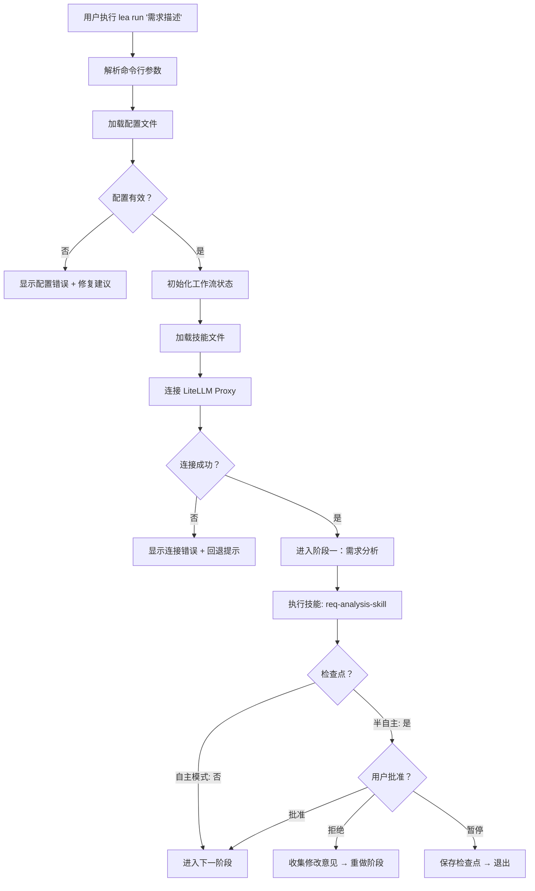
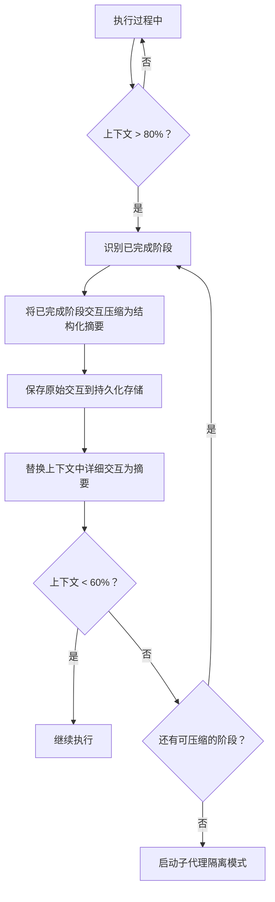
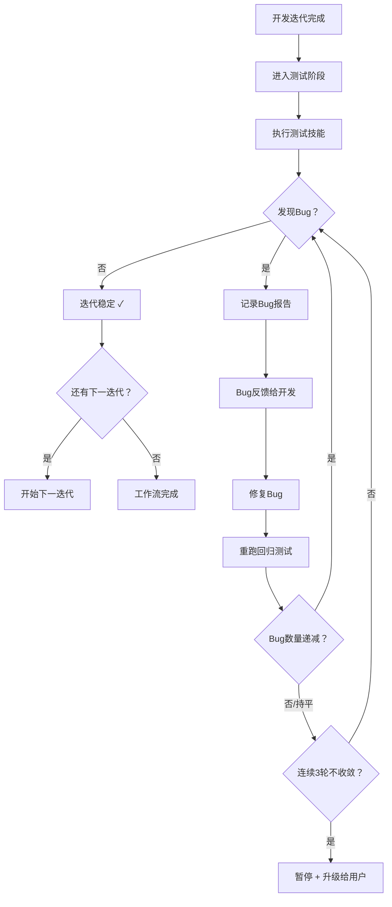
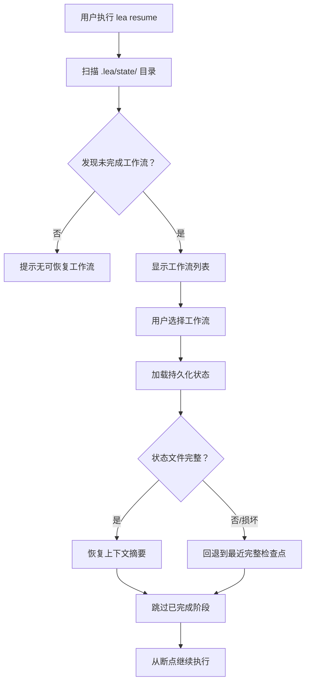
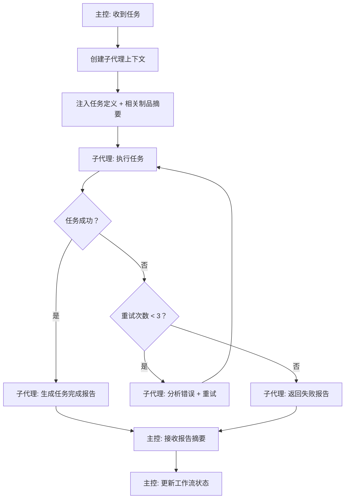
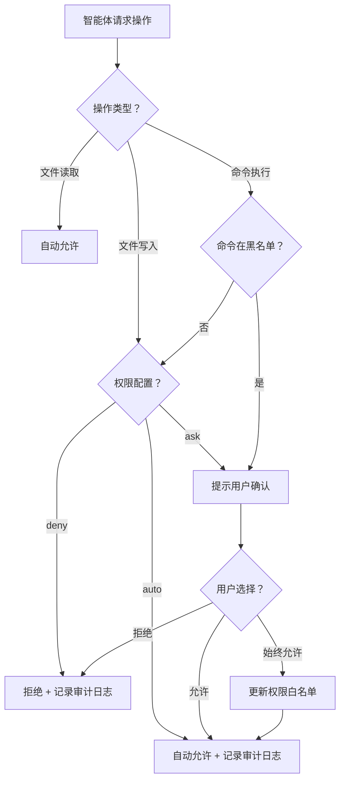

# 用户流程图

## 流程一：启动新工作流

```mermaid
flowchart TD
    A[用户执行 lea run '需求描述'] --> B[解析命令行参数]
    B --> C[加载配置文件]
    C --> D{配置有效？}
    D -->|否| E[显示配置错误 + 修复建议]
    D -->|是| F[初始化工作流状态]
    F --> G[加载技能文件]
    G --> H[连接 LiteLLM Proxy]
    H --> I{连接成功？}
    I -->|否| J[显示连接错误 + 回退提示]
    I -->|是| K[进入阶段一：需求分析]
    K --> L[执行技能: req-analysis-skill]
    L --> M{检查点？}
    M -->|自主模式: 否| N[进入下一阶段]
    M -->|半自主: 是| O{用户批准？}
    O -->|批准| N
    O -->|拒绝| P[收集修改意见 → 重做阶段]
    O -->|暂停| Q[保存检查点 → 退出]
```

## 流程二：上下文压缩

```mermaid
flowchart TD
    A[执行过程中] --> B{上下文 > 80%？}
    B -->|否| A
    B -->|是| C[识别已完成阶段]
    C --> D[将已完成阶段交互压缩为结构化摘要]
    D --> E[保存原始交互到持久化存储]
    E --> F[替换上下文中详细交互为摘要]
    F --> G{上下文 < 60%？}
    G -->|是| H[继续执行]
    G -->|否| I{还有可压缩的阶段？}
    I -->|是| C
    I -->|否| J[启动子代理隔离模式]
```

## 流程三：收敛反馈闭环（开发-测试）

```mermaid
flowchart TD
    A[开发迭代完成] --> B[进入测试阶段]
    B --> C[执行测试技能]
    C --> D{发现Bug？}
    D -->|否| E[迭代稳定 ✓]
    E --> F{还有下一迭代？}
    F -->|是| G[开始下一迭代]
    F -->|否| H[工作流完成]
    D -->|是| I[记录Bug报告]
    I --> J[Bug反馈给开发]
    J --> K[修复Bug]
    K --> L[重跑回归测试]
    L --> M{Bug数量递减？}
    M -->|是| D
    M -->|否/持平| N{连续3轮不收敛？}
    N -->|否| D
    N -->|是| O[暂停 + 升级给用户]
```

## 流程四：断点恢复

```mermaid
flowchart TD
    A[用户执行 lea resume] --> B[扫描 .lea/state/ 目录]
    B --> C{发现未完成工作流？}
    C -->|否| D[提示无可恢复工作流]
    C -->|是| E[显示工作流列表]
    E --> F[用户选择工作流]
    F --> G[加载持久化状态]
    G --> H{状态文件完整？}
    H -->|是| I[恢复上下文摘要]
    H -->|否/损坏| J[回退到最近完整检查点]
    I --> K[跳过已完成阶段]
    J --> K
    K --> L[从断点继续执行]
```

## 流程五：子代理执行

```mermaid
flowchart TD
    A[主控: 收到任务] --> B[创建子代理上下文]
    B --> C[注入任务定义 + 相关制品摘要]
    C --> D[子代理: 执行任务]
    D --> E{任务成功？}
    E -->|是| F[子代理: 生成任务完成报告]
    F --> G[主控: 接收报告摘要]
    E -->|否| H{重试次数 < 3？}
    H -->|是| I[子代理: 分析错误 + 重试]
    I --> D
    H -->|否| J[子代理: 返回失败报告]
    J --> G
    G --> K[主控: 更新工作流状态]
```

## 流程六：权限验证

```mermaid
flowchart TD
    A[智能体请求操作] --> B{操作类型？}
    B -->|文件读取| C[自动允许]
    B -->|文件写入| D{权限配置？}
    B -->|命令执行| E{命令在黑名单？}
    D -->|auto| F[自动允许 + 记录审计日志]
    D -->|ask| G[提示用户确认]
    D -->|deny| H[拒绝 + 记录审计日志]
    E -->|是| G
    E -->|否| D
    G --> I{用户选择？}
    I -->|允许| F
    I -->|始终允许| J[更新权限白名单] --> F
    I -->|拒绝| H
```
