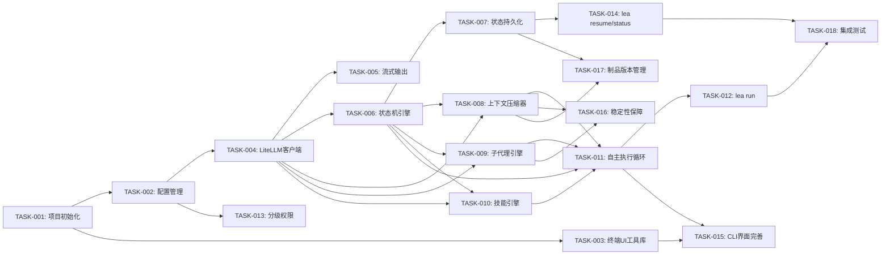

# Loop Engineering Agent — 任务分解

## 史诗

| 史诗 | 任务数 | 总工作量 | 优先级 |
|------|--------|---------|--------|
| E1: 项目基础设施 | 5 | M | P0 |
| E2: 模型集成层 | 3 | M | P0 |
| E3: 工作流引擎 | 4 | L | P0 |
| E4: 上下文管理 | 3 | XL | P0 |
| E5: 技能引擎 | 3 | L | P0 |
| E6: 自主执行闭环 | 3 | L | P0 |
| E7: 安全与权限 | 2 | S | P0 |
| E8: CLI 界面 | 4 | M | P1 |
| E9: 稳定性保障 | 2 | M | P1 |

## 任务

### TASK-001：项目初始化与构建管线
**史诗**：E1 项目基础设施
**需求追溯**：NFR-006
**设计追溯**：CLI 命令结构
**优先级**：P0
**工作量估算**：S → 3h
**依赖**：无
**验收标准**：
- Given 执行 `npm init`, When 项目初始化完成, Then 生成 tsconfig.json、package.json、src/ 目录结构
- Given 执行 `npm run build`, When 编译成功, Then 输出 dist/ 目录
- Given 执行 `npm test`, When 测试运行, Then Jest 测试框架正常工作
- Given 执行 `lea --version`, When CLI 入口已链接, Then 输出版本号

**子任务**：
1. 初始化 npm 项目 + TypeScript 配置 + ESLint + Prettier
2. 配置 Jest 测试框架
3. 创建 CLI 入口（commander.js）+ `lea version` 命令
4. 创建目录结构：src/{engine,model,context,skill,security,cli,utils}

---

### TASK-002：配置管理模块
**史诗**：E1 项目基础设施
**需求追溯**：FR-015
**设计追溯**：config.yaml 格式
**优先级**：P0
**工作量估算**：M → 6h
**依赖**：TASK-001
**验收标准**：
- Given 项目目录无配置文件, When 启动 LEA, Then 使用默认配置并提示用户运行 `lea config init`
- Given 配置文件存在且有效, When 加载配置, Then 解析为类型安全的 Config 对象
- Given 配置文件有误, When 加载配置, Then 报告具体错误行和字段
- Given 执行 `lea config init`, When 交互式引导完成, Then 生成有效 config.yaml

**子任务**：
1. 定义 Config TypeScript 类型（与 config.yaml 结构一一对应）
2. 实现配置加载、校验（zod schema）、默认值填充
3. 实现 `lea config init` 交互式引导（inquirer.js）
4. 实现 `lea config model` 子命令（列出、添加、移除、设默认）

---

### TASK-003：终端 UI 工具库
**史诗**：E1 项目基础设施
**需求追溯**：FR-011
**设计追溯**：设计令牌、CLI 组件规格
**优先级**：P0
**工作量估算**：M → 5h
**依赖**：TASK-001
**验收标准**：
- Given Spinner 组件, When 启动/完成/失败, Then 正确显示动画和状态转换
- Given 进度条组件, When 设置进度值, Then 正确渲染百分比和条形
- Given 状态面板组件, When 传入工作流状态, Then 正确渲染面板布局
- Given 终端宽度 < 60, When 渲染任何组件, Then 自动切换为最简模式

**子任务**：
1. 封装 ora/chalk 库为项目统一的 UI 工具类（Spinner、ColoredOutput）
2. 实现进度条组件（支持任务进度和 Bug 收敛趋势）
3. 实现状态面板组件（自适应终端宽度）
4. 实现 Nerd Font 检测 + ASCII fallback 逻辑

---

### TASK-004：LiteLLM Proxy 客户端
**史诗**：E2 模型集成层
**需求追溯**：FR-001, FR-002, FR-015
**设计追溯**：LiteLLM 配置、模型路由
**优先级**：P0
**工作量估算**：M → 6h
**依赖**：TASK-002
**验收标准**：
- Given LiteLLM Proxy 运行中, When 调用 chat completion, Then 成功返回响应
- Given 主模型不可用, When 配置了回退模型, Then 自动切换到回退模型
- Given 模型路由规则已配置, When 收到任务, Then 按规则选择模型
- Given 成本预算已设定, When 累计成本超限, Then 暂停执行并通知

**子任务**：
1. 实现 LLMClient 类（基于 openai SDK，连接 LiteLLM Proxy）
2. 实现路由策略（按任务类型/成本/延迟选择模型）
3. 实现回退机制（失败自动切换 + 指数退避重试）
4. 实现成本追踪（per-request token/cost 统计 + 预算控制）

---

### TASK-005：模型调用流式输出
**史诗**：E2 模型集成层
**需求追溯**：FR-001, NFR-007
**设计追溯**：模型调用日志组件
**优先级**：P1
**工作量估算**：S → 3h
**依赖**：TASK-004
**验收标准**：
- Given 模型支持 streaming, When 调用 chat completion, Then 流式输出到终端
- Given 模型调用完成, When 显示日志, Then 包含耗时、token数、成本、模型名

---

### TASK-006：工作流状态机引擎
**史诗**：E3 工作流引擎
**需求追溯**：FR-003, FR-008, FR-009
**设计追溯**：用户流程图、命令结构
**优先级**：P0
**工作量估算**：L → 12h
**依赖**：TASK-004
**验收标准**：
- Given 初始化工作流, When 按顺序推进, Then 状态按 req→design→review→task→dev→test 流转
- Given 当前阶段不满足门控条件, When 尝试推进, Then 拒绝并提示缺失条件
- Given 测试发现 Bug, When 反馈给开发, Then 状态回退到 dev
- Given 评估发现致命问题, When 需要回退, Then 状态回退到对应阶段
- Given 自主模式配置, When 工作流执行, Then 按配置跳过或暂停检查点

**子任务**：
1. 定义 WorkflowState 类型 + Phase 枚举 + Transition 规则
2. 实现 WorkflowEngine 类（状态流转、门控检查、阶段回退）
3. 实现检查点机制（按 autonomy 配置暂停/跳过）
4. 实现收敛闭环逻辑（开发-测试循环、Bug 收敛检测、不收敛升级）

---

### TASK-007：工作流状态持久化
**史诗**：E3 工作流引擎
**需求追溯**：FR-004, FR-013
**设计追溯**：断点恢复流程、persistence 配置
**优先级**：P0
**工作量估算**：M → 6h
**依赖**：TASK-006
**验收标准**：
- Given 阶段完成, When 持久化触发, Then 状态写入 .lea/state/ 目录
- Given 进程中断, When 执行 `lea resume`, Then 识别未完成工作流并恢复
- Given 状态文件损坏, When 尝试恢复, Then 回退到最近完整检查点
- Given 原子写入, When 写入过程中断, Then 不产生损坏文件

**子任务**：
1. 定义 Checkpoint schema（含 schema_version）
2. 实现 PersistenceManager（原子写入：temp + rename）
3. 实现 resume 逻辑（扫描、验证、恢复）
4. 实现损坏检测和回退

---

### TASK-008：上下文边界压缩器
**史诗**：E4 上下文管理
**需求追溯**：FR-006, NFR-001
**设计追溯**：上下文压缩流程、PhaseSummary schema
**优先级**：P0
**工作量估算**：XL → 14h
**依赖**：TASK-004, TASK-006
**验收标准**：
- Given 阶段完成, When 触发压缩, Then 生成结构化 PhaseSummary
- Given 上下文 > 80%, When 任意时刻, Then 触发紧急压缩
- Given 压缩后摘要, When 下游阶段执行, Then 能从摘要获取关键信息
- Given 原始交互已保存, When 执行 `lea history <phase>`, Then 可查看完整历史

**子任务**：
1. 实现 ContextManager（跟踪上下文使用率）
2. 实现 CompressionEngine（调用高能力模型生成 PhaseSummary）
3. 实现压缩验证（检查 downstream_handoff 完整性）
4. 实现原始交互持久化（phase-{name}-history.jsonl）

---

### TASK-009：子代理隔离引擎
**史诗**：E4 上下文管理
**需求追溯**：FR-007
**设计追溯**：子代理通信协议、Worker Threads 架构
**优先级**：P0
**工作量估算**：XL → 14h
**依赖**：TASK-004, TASK-006
**验收标准**：
- Given 任务需要子代理执行, When 启动子代理, Then 在独立 Worker Thread 中运行
- Given 子代理完成任务, When 返回结果, Then 仅返回 SubAgentResult 摘要
- Given 子代理执行失败, When 重试超限, Then 返回失败摘要给主控
- Given 子代理超时, When 超时触发, Then Worker 被终止并返回超时结果

**子任务**：
1. 实现 SubAgentManager（Worker 创建、消息传递、生命周期管理）
2. 实现 sub-agent-worker.ts（独立上下文、LLM 调用、文件系统访问）
3. 实现 SubAgentRequest/Result 消息协议
4. 实现超时和错误恢复机制

---

### TASK-010：技能解释执行引擎
**史诗**：E5 技能引擎
**需求追溯**：FR-005, FR-012
**设计追溯**：skills 配置、SKILL.md 格式
**优先级**：P0
**工作量估算**：L → 10h
**依赖**：TASK-004, TASK-006
**验收标准**：
- Given skills 目录包含有效 SKILL.md, When 启动工作流, Then 自动发现并加载所有技能
- Given 工作流进入某阶段, When 需要执行技能, Then SKILL.md 内容注入 LLM prompt
- Given 技能引用了其他技能, When 执行到引用点, Then 正确调度被引用技能
- Given 技能包含 references/ 目录, When 执行技能, Then 参考文件一并注入

**子任务**：
1. 实现 SkillLoader（扫描目录、解析 frontmatter、验证格式）
2. 实现 SkillExecutor（将 SKILL.md 映射为 LLM prompt 模板）
3. 实现技能间调度（workflow-skill 调度其他技能的解析逻辑）
4. 实现技能热发现（监听 skills 目录变更）

---

### TASK-011：自主执行循环
**史诗**：E6 自主执行闭环
**需求追溯**：FR-008, FR-009
**设计追溯**：自主执行流程、收敛反馈闭环
**优先级**：P0
**工作量估算**：L → 10h
**依赖**：TASK-006, TASK-008, TASK-009, TASK-010
**验收标准**：
- Given 工作流以自主模式启动, When 进入每个阶段, Then 自动执行直至阶段完成
- Given 遇到无法解决的错误, When 重试3次后仍失败, Then 暂停请求人工介入
- Given 测试发现Bug, When 反馈给开发, Then 自动创建修复任务
- Given 连续3轮无新Bug, When 声明迭代稳定, Then 推进到下一迭代

**子任务**：
1. 实现 AutonomousLoop（驱动工作流从 req→test 的完整循环）
2. 实现错误恢复策略（重试、回退、升级）
3. 实现收敛检测器（Bug 趋势分析、稳定判断）
4. 实现迭代管理（迭代边界、进度报告）

---

### TASK-012：`lea run` 命令集成
**史诗**：E6 自主执行闭环
**需求追溯**：FR-003, FR-008
**设计追溯**：命令行界面
**优先级**：P0
**工作量估算**：M → 5h
**依赖**：TASK-011
**验收标准**：
- Given 执行 `lea run "需求描述"`, When 工作流启动, Then 显示状态面板并开始执行
- Given --auto 标志, When 执行, Then 全程无人工介入
- Given --checkpoint 标志, When 到达指定检查点, Then 暂停等待审批
- Given --dry-run 标志, When 执行, Then 仅预演不实际操作

---

### TASK-013：分级权限控制
**史诗**：E7 安全与权限
**需求追溯**：FR-010, NFR-005
**设计追溯**：权限验证流程、permissions 配置
**优先级**：P0
**工作量估算**：M → 5h
**依赖**：TASK-002
**验收标准**：
- Given 文件读取操作, When 在任何模式, Then 自动允许
- Given 文件写入且配置为 ask, When 执行, Then 提示用户确认
- Given 命令在黑名单中, When 执行, Then 必须用户确认
- Given 用户选择"始终允许", When 后续同类操作, Then 自动允许

**子任务**：
1. 实现 PermissionManager（读取配置、校验操作、记录审计日志）
2. 实现交互式确认（inquirer.js prompt）
3. 实现审计日志（.lea/state/audit.jsonl，原子追加写入）

---

### TASK-014：`lea resume` 与 `lea status` 命令
**史诗**：E3 工作流引擎
**需求追溯**：FR-013, FR-011
**设计追溯**：断点恢复界面、状态面板
**优先级**：P0
**工作量估算**：S → 3h
**依赖**：TASK-007
**验收标准**：
- Given 存在未完成工作流, When 执行 `lea resume`, Then 列出可选择的工作流
- Given 用户选择工作流, When 恢复, Then 从断点继续执行
- Given 工作流正在执行, When 执行 `lea status`, Then 显示当前状态面板

---

### TASK-015：CLI 界面完善
**史诗**：E8 CLI 界面
**需求追溯**：FR-011, FR-014, NFR-004
**设计追溯**：命令行界面、交互模式
**优先级**：P1
**工作量估算**：M → 6h
**依赖**：TASK-003, TASK-011
**验收标准**：
- Given 执行 `lea list`, When 存在多个工作流, Then 列表显示
- Given 执行 `lea skills`, When 技能已加载, Then 显示技能列表和状态
- Given 执行 `lea compact`, When 上下文有可压缩内容, Then 触发压缩
- Given 检查点到达, When 显示交互, Then 正确渲染审批/权限/错误恢复界面

**子任务**：
1. 实现 `lea list` / `lea skills` / `lea compact` 命令
2. 实现检查点审批交互界面
3. 实现权限确认交互界面
4. 实现错误恢复倒计时界面

---

### TASK-016：长时间运行稳定性保障
**史诗**：E9 稳定性保障
**需求追溯**：NFR-003, NFR-002
**设计追溯**：长时间运行保障机制
**优先级**：P1
**工作量估算**：M → 5h
**依赖**：TASK-008, TASK-009
**验收标准**：
- Given 运行超过1小时, When 心跳正常, Then 持续执行无中断
- Given 内存超过 warning 阈值, When 检测到, Then 触发 GC 和压缩
- Given 内存超过 fatal 阈值, When 检测到, Then 保存检查点并优雅退出
- Given 进程崩溃后重启, When 执行 resume, Then 成功恢复

**子任务**：
1. 实现 HeartbeatMonitor（定时写入心跳、超时检测）
2. 实现 MemoryGuard（内存水位检测、分级响应）
3. 实现定时检查点保存（10分钟兜底）

---

### TASK-017：制品版本管理
**史诗**：E8 CLI 界面
**需求追溯**：FR-014
**设计追溯**：补充设计 `lea history` 命令
**优先级**：P1
**工作量估算**：S → 3h
**依赖**：TASK-007, TASK-008
**验收标准**：
- Given 阶段产出制品被更新, When 查看历史, Then 显示版本列表和变更时间
- Given 闭环回退修改了文档, When 查看差异, Then 显示修改前后对比
- Given 执行 `lea history req`, When 需求阶段有历史, Then 显示需求文档版本列表

---

### TASK-018：端到端集成测试
**史诗**：E9 稳定性保障
**需求追溯**：NFR-002, NFR-006
**设计追溯**：全部用户流程
**优先级**：P1
**工作量估算**：L → 8h
**依赖**：TASK-012, TASK-014
**验收标准**：
- Given 完整工作流从 req→test, When 执行, Then 所有阶段正常流转
- Given 中断并恢复, When resume, Then 从断点继续
- Given 测试发现Bug, When 开发修复, Then Bug 收敛
- Given Windows/macOS/Linux, When 运行, Then 全部通过

## 依赖图

## 关键路径

T001 → T002 → T004 → T006 → T008 → T011 → T012 → T018（预计 54h）
T009 与 T008、T010 可并行，缩短总工期。

## 可并行工作

- T002 + T003（配置管理 ‖ 终端UI）— 依赖 T001 后可同时开始
- T008 + T009 + T010（压缩器 ‖ 子代理 ‖ 技能引擎）— 三者依赖 T004+T006 后可同时开始
- T013 与 T004+ 可并行（权限模块较独立）
- T016 + T017 可在 T012 完成前并行
